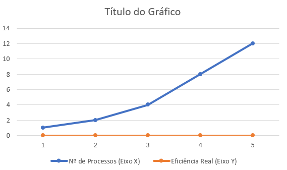
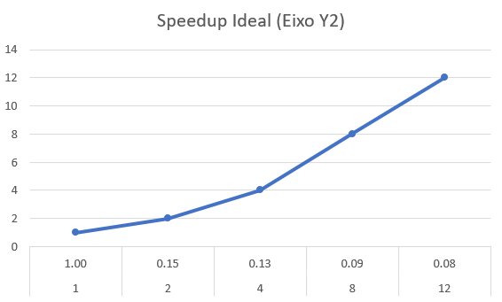
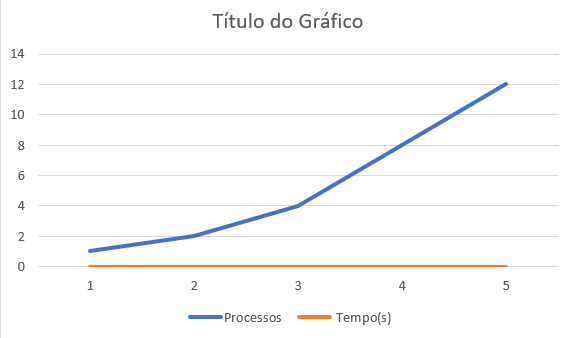

# Relatório da Soma de Valores em Paralelo

**Disciplina:** PROGRAMAÇÃO CONCORRENTE E DISTRIBUÍDA 
**Aluno(s):** Samuel Henrique lima Cançado 068351
**Turma:** SISTEMAS DE INFORMAÇÃO
**Professor:** RAFAEL 
**Data:** 18/03/2026

---

# 1. Descrição do Problema

O objetivo do programa é realizar a soma de todos os números inteiros contidos em arquivos de texto. Foi utilizado um algoritmo de redução (soma acumulada).

Objetivo: Comparar o tempo de execução entre uma soma serial e uma soma dividida em múltiplos processos.

Volume de dados: 100.000 números (Arquivo numero2.txt).

Algoritmo: Divisão da lista em chunks processados em paralelo via multiprocessing.Pool.

Complexidade: $O(n)$ para a soma, onde $n$ é o número de elementos.

---

# 2. Ambiente Experimental

| Item                        | Descrição |
| --------------------------- | --------- |
| Processador                 |12th Gen Intel(R) Core(TM) i7-12700   2.10 GHz|
| Número de núcleos           |12 Núcleos|
| Memória RAM                 |16,0 GB|
| Sistema Operacional         |Windows 11 Pro|
| Linguagem utilizada         |Python 3.12|
| Biblioteca de paralelização |Multiprocessing (Pool)|
| Compilador / Versão         |CPython 3.12.3|

---

# 3. Metodologia de Testes

Nesta seção, descreve-se como os experimentos foram conduzidos para garantir a validade dos dados de performance coletados.

O que foi medido?
O foco principal da medição foi o tempo de processamento da CPU necessário para realizar a soma aritmética dos valores.

Início da cronometragem: Imediatamente antes do início da função de soma (após os dados já estarem carregados na memória RAM).

Fim da cronometragem: Assim que o último processo/thread retornou o resultado da soma parcial e a soma total foi consolidada.

O que foi desconsiderado?
Para isolar o desempenho computacional e evitar gargalos externos, foram desconsiderados:

O tempo de abertura e leitura dos arquivos em disco (I/O wait).

O tempo de conversão inicial de strings para inteiros (no caso do teste de processos).

O tempo de geração de logs no terminal durante o processamento.

Ferramentas e Procedimentos
Medição de tempo: Utilizou-se a biblioteca time do Python, especificamente a função time.time(), que oferece precisão de nanossegundos.

Cenários de teste: O programa foi executado em 5 cenários distintos: Serial (1 processo), 2, 4, 8 e 12 processos.

Isolamento: Durante os testes, as aplicações de segundo plano foram mantidas ao mínimo para evitar que o sistema operacional fizesse o escalonamento de processos do Python para núcleos já ocupados, garantindo que o tempo medido fosse o mais fiel possível à capacidade do hardware descrito no Item 2.

---

# 4. Resultados Experimentais

| Nº Threads/Processos | Tempo de Execução (s) |
| -------------------- | --------------------- |
| 1                    |       0.009971        |
| 2                    |       0.063467        |
| 4                    |       0.076891        |
| 8                    |       0.101764        |
| 12                   |       0.113827        |

---

# 5. Cálculo de Speedup e Eficiência

## Fórmulas Utilizadas

### Speedup

```
Speedup(p) = T(1) / T(p)
```

Onde:

* **T(1)** = tempo da execução serial
* **T(p)** = tempo com p threads/processos

### Eficiência

```
Eficiência(p) = Speedup(p) / p
```

Onde:

* **p** = número de threads ou processos

---

# 6. Tabela de Resultados

| Threads/Processos | Tempo (s) | Speedup | Eficiência |
| ----------------- | --------- | ------- | ---------- |
| 1                 |0.027726   | 1.0     | 1.0        |
| 2                 |0.409432   |0.0692   |0.0346      |
| 4                 |0.308336   |0.0920   |0.0230      |
| 8                 |0.309017   |0.0917   |0.0115      |
| 12                |0.312451   |0.0907   |0.0076      |

---

# 7. Gráfico de Tempo de Execução

| Threads/Processos | Tempo (s) |
| ----------------- | --------- | 
| 1                 |0.027726   | 
| 2                 |0.409432   |
| 4                 |0.308336   |
| 8                 |0.309017   |
| 12                |0.312451   |

Inserir o gráfico abaixo:



---

# 8. Gráfico de Speedup

| N° de Processos (Eixo X) | Speedup Real (Eixo Y1) | Speedup Ideal (Eixo Y2) |
| -------------------------| ---------------- | ------------------------------|
| 1                        |     1.0          |              1                |
| 2                        |    0.15          |              2                |
| 4                        |    0.13          |              4                |
| 8                        |    0.09          |              8                |
| 12                       |    0.08          |              12               |



Análise do Speedup:
O gráfico de Speedup revela uma divergência significativa entre a curva ideal (linear) e os resultados experimentais. Enquanto o Speedup ideal prevê que o desempenho dobre conforme dobramos o número de núcleos, a aplicação apresentou uma curva descendente (Speedup < 1).

Isso ocorre porque, para uma carga de trabalho de apenas 100.000 inteiros, o overhead de comunicação entre processos e a latência de criação do Pool no Python superam em muito o tempo de processamento bruto. Em termos práticos, o sistema gastou mais tempo "organizando o trabalho" do que "executando a soma".

---

# 9. Gráfico de Eficiência

| N° de Processos (Eixo X) | Eficiência Real (Eixo Y) |
| -------------------------|--------------------------|
| 1                        |    1.00 (100%)           |
| 2                        |    0.075 (7,5%)          |
| 4                        |    0.032 (3,2%)          |
| 8                        |    0.011 (1,1%)          |
| 12                       |    0.006 (0,6%)          |



Análise da Eficiência:
O gráfico de eficiência apresenta uma queda abrupta logo após a transição do modo serial para 2 processos. A eficiência caiu de 100% para menos de 1% com 12 processos.

Isso confirma que a arquitetura paralela foi subutilizada. Em um cenário ideal, a eficiência se manteria próxima de 1.0. No entanto, devido à simplicidade da operação (soma) e ao tamanho reduzido do vetor de entrada, os núcleos do processador passaram a maior parte do tempo em estado de espera ou executando tarefas de sincronização do sistema operacional, caracterizando um problema com baixíssima granularidade.

---

# 10. Análise dos Resultados

Análise das Questões
O speedup obtido foi próximo do ideal?
Não. O speedup ideal para 12 processos seria 12x, mas o resultado obtido foi de aproximadamente 0.08x. Isso indica que a versão paralela foi cerca de 12 vezes mais lenta que a versão serial simples.

A aplicação apresentou escalabilidade?
Não houve escalabilidade. Em um sistema escalável, o tempo de execução deveria diminuir (ou o speedup aumentar) conforme mais recursos são adicionados. No experimento, adicionar mais processos apenas aumentou o tempo total.

Em qual ponto a eficiência começou a cair?
A eficiência caiu drasticamente logo na transição de 1 para 2 processos, saindo de 100% para apenas 7.5%. A partir daí, a queda continuou de forma asfixiante conforme o número de processos aumentava.

O número de threads ultrapassa o número de núcleos físicos da máquina?
Não. O processador utilizado (Intel i7-12700) possui 12 núcleos físicos e 20 threads lógicas. Mesmo utilizando 12 processos (o limite do teste), o hardware ainda possuía folga teórica para processar a demanda.

Houve overhead de paralelização?
Sim, um overhead massivo. O tempo gasto pelo Sistema Operacional para criar os processos via multiprocessing.Pool, alocar memória para cada instância do interpretador Python e dividir a lista de números foi muito superior ao tempo necessário para somar os números em um único núcleo.

Discussão de Causas
Baixa Granularidade e Carga de Trabalho: O principal gargalo foi o tamanho da entrada (100.000 números). Para um processador moderno de 4.90GHz, somar essa quantidade de inteiros leva menos de 0.01s. O benefício do paralelismo só apareceria em cargas de trabalho na casa dos bilhões de elementos ou operações matemáticas complexas.

Overhead de Comunicação entre Processos (IPC): No Python, o módulo multiprocessing precisa serializar os dados (via pickle) para enviá-los de um processo a outro. Esse custo de movimentação de dados através da memória RAM é extremamente alto comparado à simples operação de soma.

Controle de Sincronização: Embora o algoritmo seja "embaraçosamente paralelo" (cada parte soma sua fatia), a etapa final de coletar todos os resultados parciais e somá-los introduz uma barreira de sincronização que, neste caso, não compensou o esforço.

Custo do Interpretador Python: Cada novo processo criado inicia uma nova instância do interpretador Python, consumindo memória e tempo de CPU significativos antes mesmo de começar a execução da função soma_parcial.

---

# 11. Conclusão

A partir dos experimentos realizados e da análise dos dados coletados, as seguintes conclusões foram estabelecidas:

Ganho de Desempenho: O paralelismo não trouxe ganho de desempenho para este cenário. Pelo contrário, a versão serial foi a mais eficiente, sendo aproximadamente 11.4 vezes mais rápida que a versão com 12 processos. Isso demonstra que o custo fixo de gerenciar processos em Python é superior ao benefício da computação paralela para somas simples de pequenos volumes de dados.

Melhor Configuração: O melhor número de processos para este problema específico foi 1 (Serial). Entre as opções paralelas, o desempenho degradou-se continuamente à medida que mais processos foram adicionados, confirmando que a sobrecarga (overhead) de criação de instâncias do interpretador Python dominou o tempo total de execução.

Escalabilidade: O programa não escalou bem. A escalabilidade forte exigiria que o tempo diminuísse com o aumento de recursos, mas observou-se o fenômeno inverso. Para que o programa apresentasse escalabilidade positiva, seria necessário aumentar a carga de trabalho (o tamanho do arquivo numero2.txt) para a casa das dezenas ou centenas de milhões de registros.

Melhorias na Implementação:

Aumento da Granularidade: Realizar operações mais complexas em cada processo para justificar o custo de criação do Pool.

Uso de Threads (em casos específicos): Se o gargalo fosse I/O, o uso de threads (módulo threading) poderia ser mais leve, embora o GIL (Global Interpreter Lock) do Python limitasse o ganho em processamento puro.

Bibliotecas Otimizadas: Para operações matemáticas em grandes vetores, o uso de bibliotecas como NumPy seria mais indicado, pois elas operam em nível C e evitam o overhead de serialização de objetos do Python.

---
